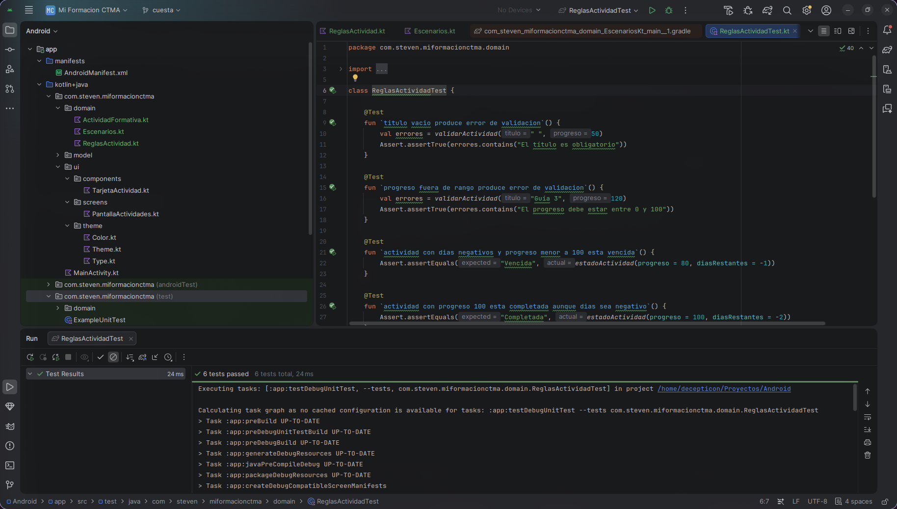

# Casos de prueba manual — Semana 4

| # | Caso | Pasos | Resultado esperado | Resultado obtenido |
|---|------|-------|---------------------|------------|
| 1 | Rotación con formulario a medias | Escribir título parcial, rotar a horizontal | El texto se conserva | ✅ |
| 2 | Back stack tras crear | Crear actividad, presionar atrás desde Lista | Sale de la app (no vuelve al formulario) | ✅ |
| 3 | Back stack tras ver detalle | Entrar a Detalle, presionar atrás | Vuelve a Lista, no a un formulario vacío | ✅ |
| 4 | Doble toque en Guardar | Tocar Guardar dos veces rápido | Solo se crea una actividad, no dos | ✅ |
| 5 | Detalle con id inexistente | (edge case) navegar a detalle/999 manualmente | Muestra "No se encontró la actividad" | ✅ (validado por preview) |
| 6 | Grid en tablet | Abrir en tablet | Se ve en 2 columnas | ✅ |
| 7 | Lista en pantalla angosta | Ver preview con ancho de teléfono | Se ve en 1 columna | ✅ |
| 8 | TalkBack en tarjeta | Activar TalkBack, deslizar sobre una tarjeta | Lee título, estado y progreso | ✅ |

